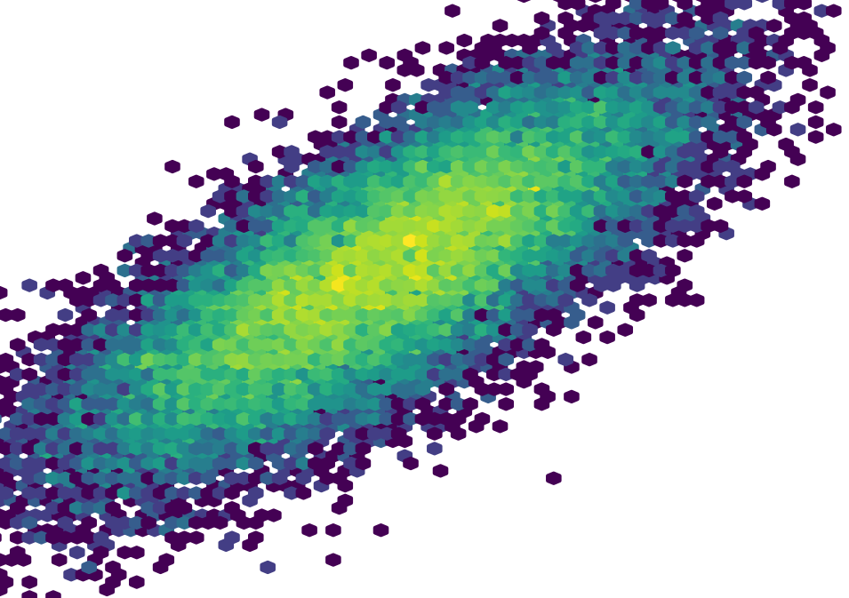

# Zachary Levonian

Hi there! I'm a data scientist and researcher.

You can learn more about my research interests [on my homepage](https://www-users.cse.umn.edu/~levon003/).

My most recent release is [llm-math-education](https://github.com/levon003/llm-math-education), a Python package implementing retrieval agumented generation with ChatGPT to support middle-school math tutoring.  

Here are a few of my research prototypes:

 - [HealthBlogRec](https://github.com/levon003/HealthBlogRec): a prototype deep learning recommender system for health blogs.
 - [ALSim](https://github.com/levon003/ALSim): a simulation library that implements several state-of-the-art active learning algorithms.
 - [wiki-ores-feedback](https://github.com/levon003/wiki-ores-feedback): a web app and auditing analysis for vandalism detection classifiers on Wikipedia.

And here are some standalone analyses:

 - [covid-data-analysis](https://github.com/levon003/covid-data-analysis): Exploratory modeling with COVID-19 patient data. Explainable logistic regression models with `Pandas`, `statsmodels`, `scikit-learn`, and `pytest`.
 - [biomarker-case-study](https://github.com/levon003/biomarker-case-study): High-performance binary classification with patient demographic and biomarker data. Gradient Boosting Machines with `Pandas` and `scikit-learn`.

